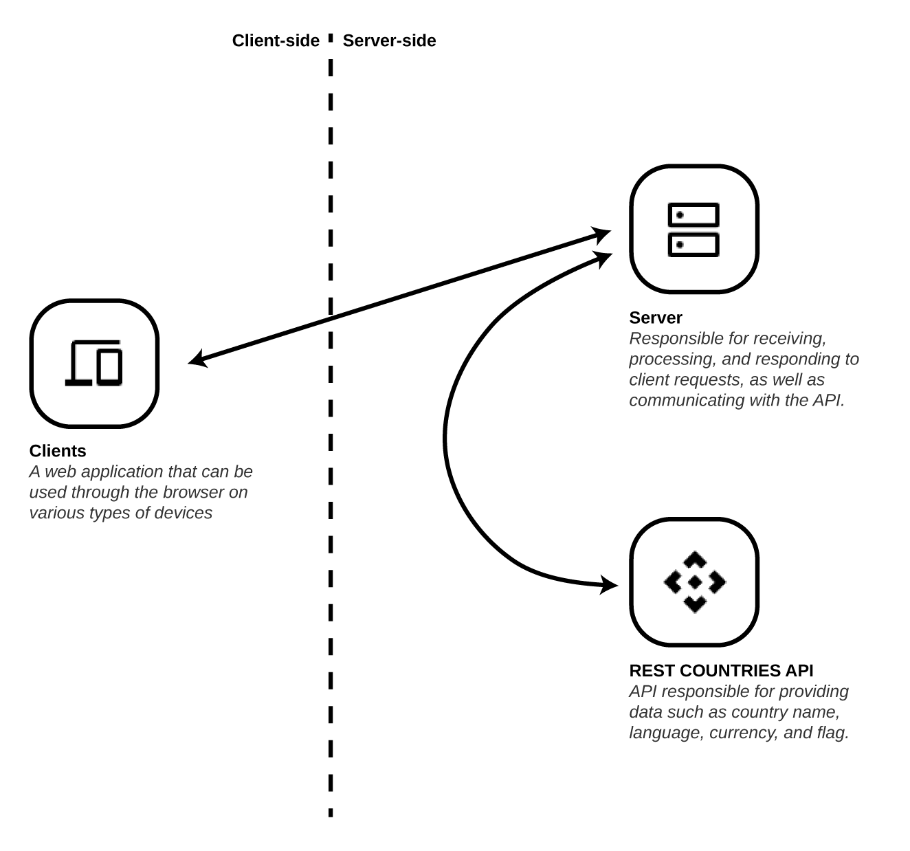

# Distributed System implementation


This simple project was developed for the class on Distributed Systems of the Computer Science graduation at UFPI. The main goal is to practice the knowledge got during the lessons.
We implemented a website with a back-end, front-end, and third-party API connection. The user can see a list of countries with their respective information (like currency and the country flag) and filter this list using the language as a parameter. The filtering is done by clicking on the interface buttons, and each click triggers an API fetch (we are using the [REST COUNTRIES API](https://restcountries.com))

# Operating diagram
<p align="center">
  
</p>

## Used techs
### Front-end
- HTML
- CSS
- JavaScript
### Back-end
- Node.js

# How to run
Pre-requisites: Node.js
``` bash
# clone repository
git clone https://github.com/viniciusmra/ufpi-sd-implementacao-sistema-distribuido

cd server

node server.js
# The server will run on localhost:3000
```

# Authors
- [Ryan Ferreira](https://github.com/rfsousa)
- [Vinícius Alves](https://github.com/viniciusmra) 
